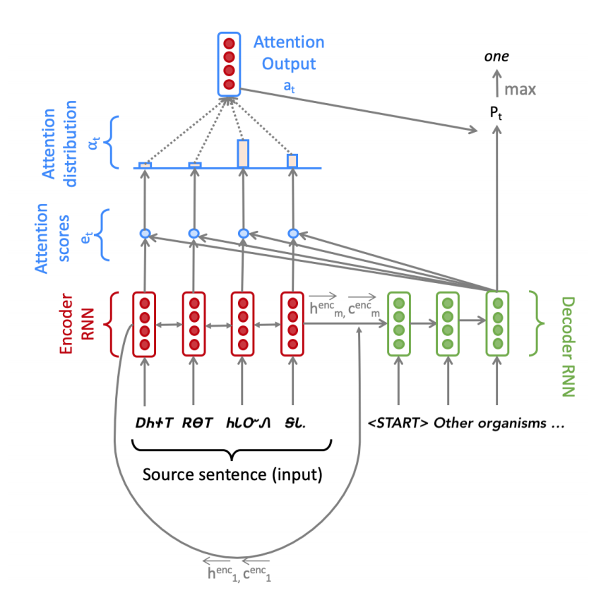
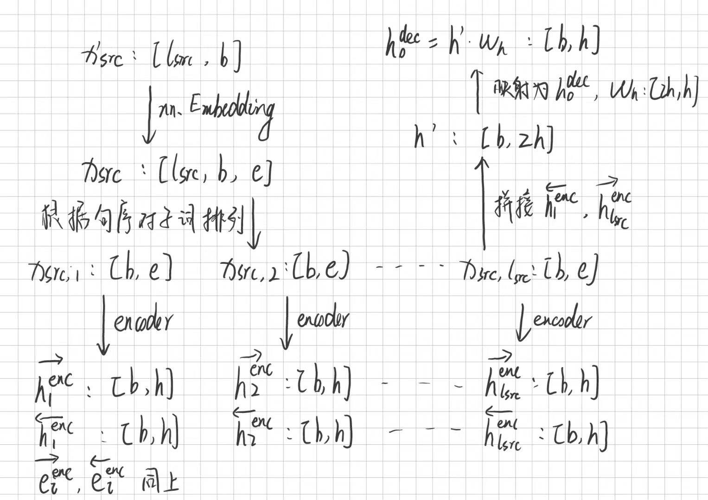
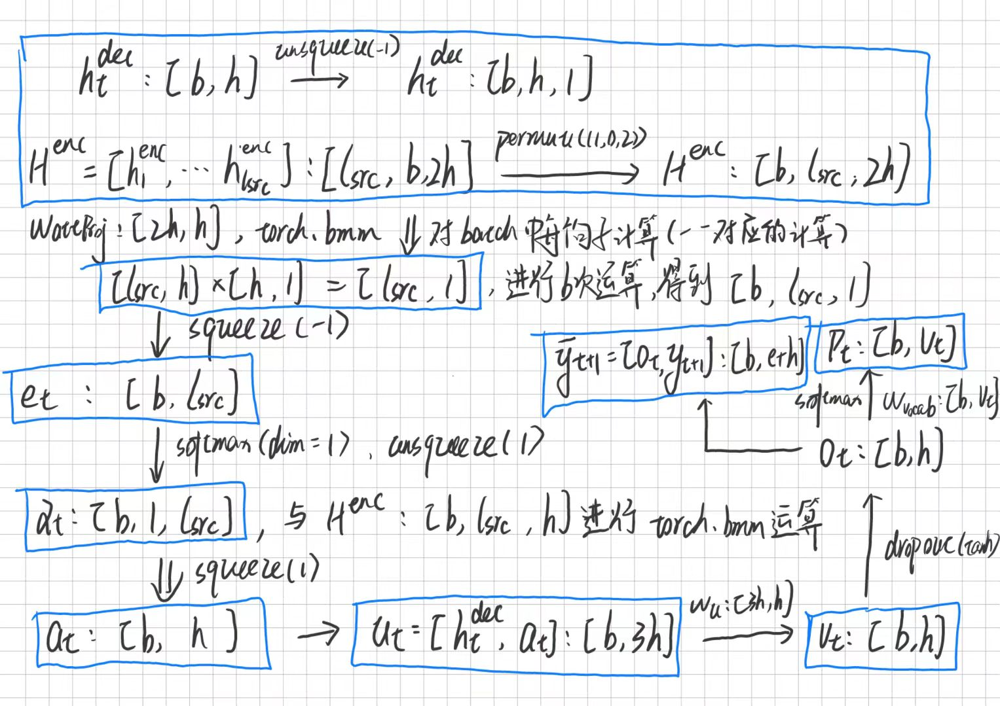

# 前言

本文以[CS224n](https://web.stanford.edu/class/archive/cs/cs224n/cs224n.1214/)课程中assignment4的代码和数据作为基础，探讨基于注意力的LSTM机器翻译模型。笔者认为，只有摸清了一个模型从输入到输出过程中的数据维度变化及其原因才是真正掌握了一个模型的结构，所以本文从数据流动及维度变化的角度出发对模型进行解释，着重关注计算过程中张量维度的变化，简单介绍模型原理到代码实践之间的处理。

# 模型整体结构



该模型主要分为两部分：encoder和decoder，encoder由双向LSTM构成，decoder由单向LSTM构成。在进行翻译任务时，encoder在源语言句子上对信息进行提取，然后将信息传递给decoder进行句子生成（所翻译出来的目标语言句子）。为了加强decoder对源语言句子信息的分析能力，其在生成单词的每一时间步都会与encoder中所有时间步的隐藏状态向量进行注意力的计算并对这些向量分配不同的权重，以实现解码过程中不同时间步对源语言句子中不同位置信息的侧重，使decoder更关注当前时间步需要提取的特征。

# 数据流动

本文主要关注`pytorch`模块外的数据流动和维度变化，具体模块如`nn.LSTM`或`nn.LSTMCell`中的数据变化还请到官方文档中查看输入和输出的解释。

## 数据集处理

在刚接触语言类型的任务时，笔者最先关注的问题是：数据是长什么样的？这是整个模型构建和代码实践的基础，要了解模型过程中数据的维度变化，就必须先了解原始数据是经过什么样的处理才输入模型的。

本文模型要翻译的源语言是切罗基语（Cherokee），目标语言是英语。语料被划分为6个文件：源语言训练集和目标语言训练集、源语言验证集和目标语言验证集、源语言测试集和目标语言测试集。代码中使用utf8进行文件读取，文件内的格式为每行一个句子，对应数据集中的对应行句子含义相同（以训练集为例，第一个代码块中是切罗基语训练集的前三行，第二个代码块是英语训练集中的前三行。其余数据集格式相同）。

```
ᎠᎴ ᎾᏍᎩ ᏅᏗᎦᎵᏍᏙᏗᎭ ᏂᎦᏛ ᎠᏃᎯᏳᎲᏍᎩ ᎠᎾᏚᏓᎴᎭ ᏂᎦᎥ ᏧᏓᎴᏅᏛ, ᎾᏍᎩ ᎨᏣᏚᏓᎳᎡᏗ ᏂᎨᏒᎾ ᏥᎨᏒ ᎼᏏ ᎤᏤᎵ ᏗᎧᎿᏩᏛᏍᏗ ᏕᏥᎧᎿᏩᏗᏒ ᎢᏳᏍᏗ.
ᎤᏯᎪᏅ ᎠᏰᎸᎢ, ᎠᏍᎪᎵ ᎤᏍᏆᏄᏤ ᎫᏕᎶᎰᎯᏍᏗ ᏄᏍᏛ ᎢᎪᎯᏛ, ᏩᏥᎳᏉ ᎢᏳᏍᏗ.
ᎠᏎᏃ ᎾᏂᎥ ᎤᎾᏤᎵᏛᎭ; ᎦᎶᏁᏛ ᏧᏓᎴᏅᏔᏅᎯ; ᎣᏂᏃ ᎾᏍᎩ ᎾᎦᎶᏁᏛ ᏧᏤᎵ ᎨᏒ ᎾᎯᏳ ᎦᎷᏨᎭ.
```

```
and by him every one that believeth is justified from all things, from which ye could not be justified by the law of Moses.
When he was done with the body, he held the head in his mouth and sucked until it held no more flavor than his own spit.
But each in his own order: Christ the firstfruits; then they that are Christ’s, at his coming.
```

在项目代码中，会使用`sentencepiece`库直接读取文件对句子进行分词操作，最终每行句子会变成一个由str类型元素构成的列表，珍格格数据集就会被处理为`(list(list(str)))`形式的列表，其中第一层列表保存的是不同的句子，第二层保存的是当前句子的分词结果列表，这就是数据被输入模型前的所有处理

```
# 分词处理前: 'The dead organisms decompose.'
# 分词处理后: ['▁The', '▁dead', '▁organisms', '▁decompose', '.']
```

## Embedding

### 公式

根据结果构建词语映射到唯一数字索引的字典，根据最长句子的长度，使用填充标记统一所有句子的长度，把数据集由`(list(list(str)))`的形式转换为二维张量，第一维依然是不同的句子，第二维是句子中每个分词对应数字索引，即得到维度为`(num_sentences, max_len)`的张量（在代码中，列表到张量的处理被放进模型的前向传播函数中）。

由于一般是以batch的形式进行模型数据的输入，所以这里假设模型接收的源语言数据和目标语言数据为：
$$
X_{src}^{'}\in R^{l_{src}\times b}
,\quad X_{tgt}^{'}\in R^{l_{tgt}\times b},
$$
其中$X_{src}^{'}$和$X_{tgt}^{'}$分别表示源语言数据和目标语言数据，$l_{src}$和$l_{tgt}$分别表示源语言和目标语言中的最大句子长度（在本文使用的图片中，$l_{src}$被表示为$m$），$b$表示当前batch大小。

数据集经过处理后，在模型的前向传播过程中，需要对分词进行嵌入操作（为每个索引构建一个嵌入向量，所有的向量构成嵌入矩阵），将每个单词的索引映射到对应的嵌入向量后，数据维度为
$$
X_{src}\in R^{l_{src}\times b\times e}
,\quad X_{tgt}\in R^{l_{tgt}\times b\times e},
$$
其中$e$表示嵌入向量的长度。

### 代码

数据集经过处理后，在模型的前向传播过程中，需要对分词进行嵌入操作（为每个索引构建一个嵌入向量，所有的向量构成嵌入矩阵），所以分别为源语言和目标语言构建嵌入层，由于嵌入层也是需要进行训练的参数，所以该部分必须包含在模型类中。

```python
self.source = nn.Embedding(num_embeddings=len(vocab.src),  # 字典大小/需要embedding的单词个数
                                   embedding_dim=embed_size,  # 每个嵌入向量的长度，即e
                                   padding_idx=src_pad_token_idx)  # 填充符号的对应索引，训练时该向量不更新
self.target = nn.Embedding(num_embeddings=len(vocab.tgt),
                                   embedding_dim=embed_size,
                                   padding_idx=tgt_pad_token_idx)
```

具体的调用过程为：

```python
X = self.source(X)
```

## Encode



### 公式

根据模型流程，这一步需要对源语言句子使用双向LSTM进行编码，设双向LSTM中每个时间步上的隐藏状态和单元状态为
$$
\mathbf{h}_{i}^{\mathrm{enc}}=[\overleftarrow{\mathbf{h}_{i}^{\mathrm{enc}}},\overrightarrow{\mathbf{h}_{i}^{\mathrm{enc}}}],\quad \mathbf{h}_{i}^{\mathrm{enc}}\in\mathbb{R}^{b\times 2h},\quad \overleftarrow{\mathbf{h}_{i}^{\mathrm{enc}}},\overrightarrow{\mathbf{h}_{i}^{\mathrm{enc}}}\in\mathbb{R}^{b\times h},\quad \quad 1\leq i\leq l_{src}
$$

$$
\mathbf{c}_{i}^{\mathrm{enc}}=[\overleftarrow{\mathbf{c}_{i}^{\mathrm{enc}}},\overrightarrow{\mathbf{c}_{i}^{\mathrm{enc}}}],\quad \mathbf{c}_{i}^{\mathrm{enc}}\in\mathbb{R}^{b\times 2h},\quad \overleftarrow{\mathbf{c}_{i}^{\mathrm{enc}}},\overrightarrow{\mathbf{c}_{i}^{\mathrm{enc}}}\in\mathbb{R}^{b\times h},\quad \quad 1\leq i\leq l_{src}
$$

其中$h$表示encoder中双向LSTM中的隐藏状态向量长度和单元状态向量长度（代码中表示为`hidden_size`），$\mathrm{enc}$上标表示隐藏状态张量来源于encoder，$\rightarrow$表示正向LSTM，$\leftarrow$表示反向LSTM，下标$i$表示在第$i$个输入上的输出。

由于decoder输入中的隐藏状态和单元状态均来源于encoder，为了进一步提取源语言句子特征，decoder中的初始隐藏状态和初始单元状态由encoder中最后一个时间步中的隐藏状态和单元状态经过一个无偏置线性层的映射后得到，特别的，以隐藏状态向量为例，正向LSTM的最后一个输出是$\overrightarrow{\mathbf{h}_{l_{src}}^{\mathrm{enc}}}$，反向LSTM的最后一个输出是$\overleftarrow{\mathbf{h}_1^{\mathrm{enc}}}$，并且假设encoder和decoder中的隐藏状态向量长度相同，即均为$h$，可以计算得到：
$$
\mathbf{h}_0^{\mathrm{dec}}=[\overleftarrow{\mathbf{h}_1^{\mathrm{enc}}},\overrightarrow{\mathbf{h}_{l_{src}}^{\mathrm{enc}}}]\mathbf{W}_h,\quad\mathbf{h}_0^{\mathrm{dec}}\in\mathbb{R}^{b\times h},\quad \mathbf{W}_h\in\mathbb{R}^{2h\times h},
$$

$$
\mathbf{c}_0^{\mathrm{dec}}=[\overleftarrow{\mathbf{c}_1^{\mathrm{enc}}},\overrightarrow{\mathbf{c}_{l_{src}}^{\mathrm{enc}}}]\mathbf{W}_c,\quad\mathbf{c}_0^{\mathrm{dec}}\in\mathbb{R}^{b\times h},\quad \mathbf{W}_c\in\mathbb{R}^{2h\times h},
$$

其中$\mathbf{h}_0^{\mathrm{dec}}$和$\mathbf{c}_0^{\mathrm{dec}}$即表示decoder中的初始隐藏状态和初始单元状态。

### 代码

首先需要在类中定义encoder。

```python
self.encoder = nn.LSTM(input_size=embed_size,  # 每个时间步所输入特征的大小,即为嵌入向量长度e
                       hidden_size=hidden_size,  # 指定LSTM隐藏层的大小
                       bidirectional=True)  # encoder使用的是双向LSTM
# 该代码中LSTM的隐藏状态向量长度会和单元状态向量长度相同
```

将前面经过嵌入处理的数据$X_{src}$输入编码器，可以得到三个返回：encoder在所有时间步上的隐藏状态（代码中为`enc_hiddens`）、最后一个时间步上的隐藏状态（`last_hidden`）和最后一个时间步上的单元状态（`last_cell`）。代码中该步骤表示为：

```python
enc_hiddens, (last_hidden, last_cell) = self.encoder(X)
# enc_hiddens: (src_len, batch_size, 2*hidden_size)
# last_hidden: (2, batch_size, hidden_size)
# last_cell: (2, batch_size, hidden_size)
```

随后，定义无偏置线性层：

```python
# W_h和W_c的定义
self.h_projection = nn.Linear(in_features=2 * hidden_size,  # 输入维度为2h
								out_features=hidden_size,  # 输出维度为h
								bias=False)  # 不使用偏置
self.c_projection = nn.Linear(in_features=2 * hidden_size, out_features=hidden_size, bias=False)
```

计算decoder中的初始隐藏状态和初始单元状态：

```python
# h_projection:(batch_size, 2*hidden_size) -> (batch_size, hidden_size)
init_decoder_hidden = self.h_projection(torch.cat((last_hidden[0], last_hidden[1]), dim=1))
# c_projection: (batch_size, 2*hidden_size) -> (batch_size, hidden_size)
init_decoder_cell = self.c_projection(torch.cat((last_cell[0], last_cell[1]), dim=1))
```

其中`last_hidden`的维度为`(2, batch_size, encode_hidden_size)`，所以需要经过`torch.cat`操作使其符合$\mathbf{h}_{l_{src}}^{\mathrm{enc}}\in\mathbb{R}^{b\times 2h}$的维度，最后得到经过计算的decoder初始状态。

## Decode



### 公式

前面已经计算出了decoder的初始隐藏状态和初始单元状态，现在需要分析decoder每一步的输入。与encoder中每一步的输入是当前位置的子词嵌入向量不同，decoder除了嵌入向量外，还拼接了来自前一步中用于计算实际输出单词的**组合输出向量**，现在忽略decoder中每一步的输入，先对每一步的输出和与encoder中注意力的计算进行分析。

假设在decoder的第$t$个位置进行计算，单向LSTM的隐藏状态张量为
$$
\mathbf{h}_{t}^{\mathrm{dec}}=[\mathbf{h}_{t,1}^{\mathrm{dec}};\cdots;\mathbf{h}_{t,b}^{\mathrm{dec}}]\in\mathbb{R}^{b\times h},
\quad
\mathbf{h}_{t,k}^{\mathrm{dec}}\in\mathbb{R}^{1\times h}
,\quad
1\leq k\leq b,
,\quad
1\leq t\leq l_{tgt},
$$
$\mathrm{dec}$上标表示隐藏状态张量来源于decoder，此处$h$表示decoder中单向LSTM中的隐藏状态向量长度和单元状态向量长度（代码中表示为`hidden_size`），即与encoder中的设置相同。另外，$\mathbf{h}_{t,k}^{\mathrm{dec}}$表示batch中LSTM在第$k$个句子中第$t$个位置的输出，类似的，可以把encoder中双向LSTM中每个时间步上的隐藏状态张量表示为
$$
\mathbf{h}_{i}^{\mathrm{enc}}=[\mathbf{h}_{i,1}^{\mathrm{enc}};\cdots;\mathbf{h}_{i,b}^{\mathrm{enc}}]\in\mathbb{R}^{b\times 2h},
\quad
\mathbf{h}_{i,k}^{\mathrm{enc}}\in\mathbb{R}^{1\times 2h}
,\quad
1\leq k\leq b,
,\quad
1\leq i\leq l_{src},
$$
其中，$\mathbf{h}_{i,k}^{\mathrm{enc}}$表示batch中双向LSTM在第$k$个句子中第$i$个位置的输出。

现在针对**第$k$个句子**中decoder的**第$t$个位置**的隐藏状态张量与encoder中**第$i$个位置**的隐藏状态张量进行注意力计算：
$$
\mathbf{e}_{t,i,k}=\mathbf{h}_{i,k}^\text{enc}\mathbf{W}_\text{attProj}(\mathbf{h}_{t,k}^{\text{dec}})^T\in\mathbb{R},\quad
\mathbf{e}_{t,k}\in\mathbb{R}^{l_{src}},\quad 
\mathbf{W}_\text{attProj}\in\mathbb{R}^{2h\times h},
$$
其中$\mathbf{e}_{t,k}$表示**第$k$个句子**中decoder中的**第$t$个位置**的隐藏状态张量与**第$k$个句子**中所有位置的隐藏状态张量计算得到的注意力结果，将其输入softmax函数计算分配给不同向量的权重：
$$
\alpha_{t,k}=\mathrm{softmax}(\mathbf{e}_{t,k}),\quad \alpha_{t,k}\in\mathbb{R}^{l_{src}},
$$
基于权重计算encoder中所有位置隐藏状态张量的加权和：
$$
\mathbf{a}_{t,k}=\sum\limits_{i=1}^{l_{src}}\alpha_{t,k,i}\mathbf{h}_{i,k}^{\text{enc}},\quad \mathbf{a}_{t,k}\in\mathbb{R}^{1\times2h},
$$
那么整个batch中所有句子的**第$t$个位置**与encoder中隐藏状态张量的注意力计算结果可以表示为
$$
\mathbf{a}_{t}=[\mathbf{a}_{t,1};\cdots;\mathbf{a}_{t,b}]\in\mathbb{R}^{b\times 2h},
$$
进一步将其与当前时间步（即第$t$步）的隐藏状态张量进行拼接，得到
$$
\mathbf{u}_t=[\mathbf{a}_t,\mathbf{h}_t^{\mathrm{dec}}]\in\mathbb{R}^{b\times3h},
$$
得到当前时间步经过与encoder注意力计算的实际输出后，现在再对其进行一次无偏置线性层的映射：
$$
\mathbf{v}_t=\mathbf{u}_t\mathbf{W}_u,\quad\mathbf{v}_t
\in\mathbb{R}^{b\times h}
,\quad
\mathbf{W}_u\in\mathbb{R}^{3h\times h},
$$
基于该向量使用$\tanh$函数和dropout层得到本部分一开始提到的“**组合输出向量**”：
$$
\mathbf{o}_t=\text{dropout}(\tanh(\mathbf{v}_t)),\quad\mathbf{o}_t\in\mathbb{R}^{b\times h},
$$
该向量有两个用处，其一是映射后得到**当前时间步对下一时间步所预测单词**的概率：
$$
\mathbf{P}_t=\text{softmax}(\mathbf{o}_t\mathbf{W}_\text{vocab})
,\quad
\mathbf{P}_t\in\mathbb{R}^{b\times V_t}
,\quad
\mathbf{W}_\text{vocab}\in\mathbb{R}^{h\times V_t}
$$
其中$V_t$表示目标语言词汇表中单词的个数，基于该预测结果可以与下一时间步中正确单词的独热编码向量$\mathbf{g}_t$计算交叉熵损失函数值：
$$
J_t(\theta)=CrossEntropy(\mathbf{P}_t,\mathbf{g}_t),
$$


除了该作用外，$\mathbf{o}_t$将与下一时间步正确单词的嵌入向量$\mathbf{y}_{t+1}$进行拼接得到decoder的实际输入：
$$
\overline{\mathbf{y}}_{t+1}=[\mathbf{o}_t,\mathbf{y}_{t+1}]\in\mathbb{R}^{b\times(e+h)},
$$
特别的，如果是decoder的第一步，还未存在前一步的$\mathbf{o}_t$时，直接使用零向量作为代替。

### 代码

该部分涉及的计算比较多，首先对用到的模块进行定义：

```python
# decoder中需要单步计算注意力，所以使用LSTMCell
self.decoder = nn.LSTMCell(input_size=embed_size + hidden_size,  # 输入经过o_t和y_{t+1}拼接
                           hidden_size=hidden_size)  # 输出的维度依然为h
# 注意力计算中出现的参数矩阵
self.att_projection = nn.Linear(in_features=2 * hidden_size, 
                                 out_features=hidden_size,
                                 bias=False)
# 用于将u_t映射到组合输出向量的W_u
self.combined_output_projection = nn.Linear(in_features=3 * hidden_size, 
                                            out_features=hidden_size, 
                                            bias=False)
# 用于将O_t映射到单词预测概率的W_{vocab}
self.target_vocab_projection = nn.Linear(in_features=hidden_size, 
                                         out_features=len(vocab.tgt),  # 映射后的维度为词汇表中单词个数
                                         bias=False)
self.dropout = nn.Dropout(p=dropout_rate)
```

计算注意力分数中的编码器部分，避免后面进行重复的运算：

```python
# (batch_size, src_len, encode_hidden_size*2) -> (batch_size, src_len, decode_hidden_size)
enc_hiddens_proj = self.att_projection(enc_hiddens)
```

由于每一步的损失函数值是基于对下一步单词的预测来计算，所以当前步的输入仍然是正确的单词，需要对每一个时间步中正确的单词获取其对应的嵌入向量：

```python
Y = self.model_embeddings.target(target_padded)  # 对目标句子进行编码，(tgt_len, b, e)
```

随后就是decoder中的单向LSTM计算过程，由于LSTM会直接计算完整的句子，而decoder中额外添加了关于encoder注意力信息的计算，所以其计算过程需要手动逐步计算，所以用`nn.LSTMCell`定义decoder，手动在数据集中按照顺序获取不同的时间步输入，并按照前面提到的计算过程完成张量拼接：

```python
for Y_t in torch.split(Y, 1):  # (1, b, e)
    Y_t = torch.squeeze(Y_t)  # (b, e)
    Ybar_t = torch.cat((Y_t, o_prev), dim=1)  # (b, e), (b, h) -> (b, e + h)
    dec_state, combined_output, e_t = self.step(Ybar_t, 
                                                dec_state,  # (tuple(Tensor, Tensor)) 初始隐藏状态和单元状态
                                                enc_hiddens,  # 编码器所有隐藏状态
                                                enc_hiddens_proj,  # 注意力分数中的编码器部分
                                                enc_masks)
    combined_outputs.append(combined_output)  # 将组合输出向量加入列表中
    o_prev = combined_output
    combined_outputs = torch.stack(combined_outputs)  # (tgt_len, b, h)
```

其中的`step`函数核心计算过程为

```python
dec_state = self.decoder(Ybar_t, dec_state)  # (b, e + h) -> (b, h)
dec_hidden, dec_cell = dec_state  # (b, h), (b, h)
e_t = torch.bmm(enc_hiddens_proj, torch.unsqueeze(dec_hidden, dim=2)).squeeze(-1)
alpha_t = F.softmax(e_t, dim=1)
a_t = torch.bmm(torch.unsqueeze(alpha_t, dim=1), enc_hiddens).squeeze(1)
u_t = torch.cat([dec_hidden, a_t], dim=1)
v_t = self.combined_output_projection(u_t)
O_t = self.dropout(F.tanh(v_t))
```

其中每个变量名对应上文中的公式。

# 总结

整个模型涉及的变量和维度变化比较复杂，不免出现一些错误，请见谅，欢迎指出其中的问题！

由于讲义中的变量维度和实际代码中的数据维度存在一定差异，所以本篇文章实际上来源于对CS224n中assignment4作业笔记的总结，该作业的引导非常详细和优秀，受限于篇幅，上面出现的这些代码都是模型及其核心的部分，但整个项目的代码编写的都十分优秀，有很多可以深入学习的地方，比如测试模型时需要用的beam search代码等。这里将笔者注释过的代码放出来供大家参考。
